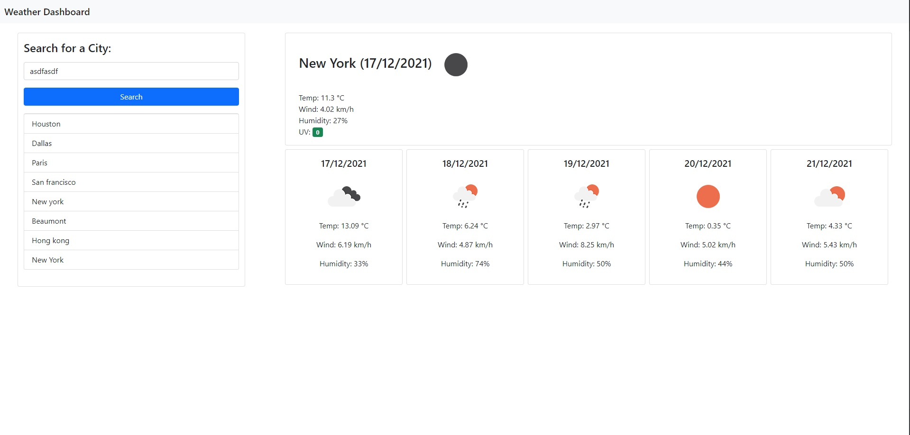

"# challenge6" 

# Work Day Scheduler Starter Code
  

## Description

This is a project that was made to help assist someone in viewing the weather forecast. By typing in any valid city name
you will be able to see the temperature, wind, humidity for today and the next 5 days as well as the current uv index 
for that city at the time of search. Icons are also displayed for each day to display what kind of weather to expect 
for each day. The users previous searches as also saved locally on the device so that the user simply has to click on a 
previously searched city rather than typing in the city name manually every single time.

## Table of Contents

* [Installation](#installation)
* [Usage](#usage)
* [Credits](#credits)
* [License](#license)

## Installation

If you would like to run this website on your local machine all you need to do is clone or download the repository
and open index.html in the browser of your choice.

## Usage

To use the Weather Dashboard go [here](https://moonryc.github.io/challenge6/) and simply search for a city 
or select a city you have already searched and the data displayed will be updated.

## Credits

* Trilogy Education Services
* Bootstrap
* Moment.js
* JQuery
* [OpenWeather](https://openweathermap.org/api/one-call-api#hist_parameter) (retrieving weather data and weather images)
* [Cancer.org](https://www.cancer.org.au/cancer-information/causes-and-prevention/sun-safety/uv-index) (The ranges for UV index severity)

## License

MIT License

Copyright (c) [2021] [Ryan Moon]

Permission is hereby granted, free of charge, to any person obtaining a copy
of this software and associated documentation files (the "Software"), to deal
in the Software without restriction, including without limitation the rights
to use, copy, modify, merge, publish, distribute, sublicense, and/or sell
copies of the Software, and to permit persons to whom the Software is
furnished to do so, subject to the following conditions:

The above copyright notice and this permission notice shall be included in all
copies or substantial portions of the Software.

THE SOFTWARE IS PROVIDED "AS IS", WITHOUT WARRANTY OF ANY KIND, EXPRESS OR
IMPLIED, INCLUDING BUT NOT LIMITED TO THE WARRANTIES OF MERCHANTABILITY,
FITNESS FOR A PARTICULAR PURPOSE AND NONINFRINGEMENT. IN NO EVENT SHALL THE
AUTHORS OR COPYRIGHT HOLDERS BE LIABLE FOR ANY CLAIM, DAMAGES OR OTHER
LIABILITY, WHETHER IN AN ACTION OF CONTRACT, TORT OR OTHERWISE, ARISING FROM,
OUT OF OR IN CONNECTION WITH THE SOFTWARE OR THE USE OR OTHER DEALINGS IN THE
SOFTWARE.
---